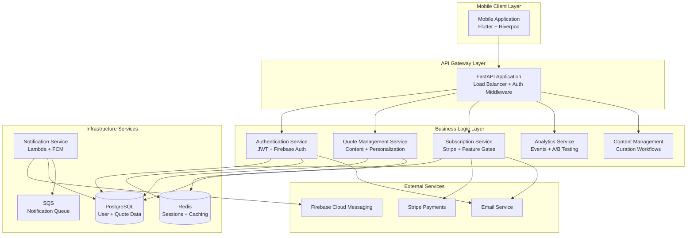

# Components

## Mobile Application (Flutter)

**Responsibility:** Cross-platform mobile client providing quote consumption, user interaction, and subscription management interfaces for iOS and Android users.

**Key Interfaces:**
- REST API communication via HTTP client
- Firebase Cloud Messaging for push notifications
- Local SQLite database for offline quote caching
- Platform-specific integrations (iOS/Android notification settings)

**Dependencies:** Authentication Service, Quote Service, Subscription Service, Local Storage Service

**Technology Stack:** Flutter 3.16.0, Dart 3.0.0, Riverpod state management, SQLite for local caching

## Authentication Service (FastAPI)

**Responsibility:** User registration, login, JWT token management, and session handling with Firebase Auth integration for mobile-optimized authentication flow.

**Key Interfaces:**
- `/auth/*` REST endpoints for registration/login
- JWT token generation and validation middleware
- Firebase Auth token verification
- Password reset email workflows

**Dependencies:** User Database, Redis Session Cache, Email Service

**Technology Stack:** FastAPI with OAuth2, Firebase Admin SDK, PostgreSQL user storage, Redis session management

## Quote Management Service (FastAPI)

**Responsibility:** Core quote delivery logic, content curation workflows, user interaction tracking (stars, views), and personalized quote selection algorithms.

**Key Interfaces:**
- `/quotes/*` REST endpoints for quote CRUD operations
- Daily quote selection and delivery scheduling
- Quote search and filtering (premium features)
- Content curation dashboard APIs

**Dependencies:** Quote Database, User Service, Analytics Service, Content Management System

**Technology Stack:** FastAPI with SQLAlchemy ORM, PostgreSQL with full-text search, Redis caching for quote delivery optimization

## Notification Delivery Service (Lambda)

**Responsibility:** Reliable push notification delivery via Firebase Cloud Messaging with retry logic, delivery tracking, and timezone-aware scheduling for global user base.

**Key Interfaces:**
- AWS Lambda function triggered by CloudWatch Events
- Firebase Cloud Messaging API integration
- SQS queue for retry logic and delivery tracking
- CloudWatch metrics for delivery success monitoring

**Dependencies:** User Database, Quote Service, Firebase FCM, AWS SQS

**Technology Stack:** AWS Lambda with Python runtime, Firebase Admin SDK, SQS for message queuing, CloudWatch for monitoring

## Subscription Management Service (FastAPI)

**Responsibility:** Premium subscription lifecycle management, Stripe payment processing, feature access control, and freemium conversion tracking with A/B testing support.

**Key Interfaces:**
- `/subscription/*` REST endpoints for subscription CRUD
- Stripe webhook handling for payment events
- Feature gate middleware for premium access control
- Subscription analytics and conversion tracking

**Dependencies:** User Database, Stripe API, Analytics Service, Email Service

**Technology Stack:** FastAPI with Stripe SDK, PostgreSQL for subscription data, webhook signature verification, automated billing reconciliation

## Analytics & Metrics Service (FastAPI + Lambda)

**Responsibility:** User engagement tracking, content performance analytics, A/B testing infrastructure, and business intelligence data collection for conversion optimization.

**Key Interfaces:**
- Event tracking APIs for user interactions
- A/B testing configuration and result calculation
- Analytics dashboard APIs for business metrics
- Data warehouse ETL processes for reporting

**Dependencies:** User Database, Quote Database, AWS CloudWatch, External Analytics Tools

**Technology Stack:** FastAPI for real-time events, Lambda for batch processing, CloudWatch for infrastructure metrics, PostgreSQL analytics schema

## Content Management System (FastAPI)

**Responsibility:** Quote curation workflows, content quality assurance, copyright management, and curator tools for maintaining premium content standards that differentiate from AI-generated alternatives.

**Key Interfaces:**
- Admin dashboard for quote approval workflows
- Content categorization and tagging systems
- Quality scoring and user feedback integration
- Copyright and attribution management

**Dependencies:** Quote Database, User Feedback, External Content Sources

**Technology Stack:** FastAPI admin interface, PostgreSQL with full-text indexing, file upload integration with S3

## Component Diagrams

