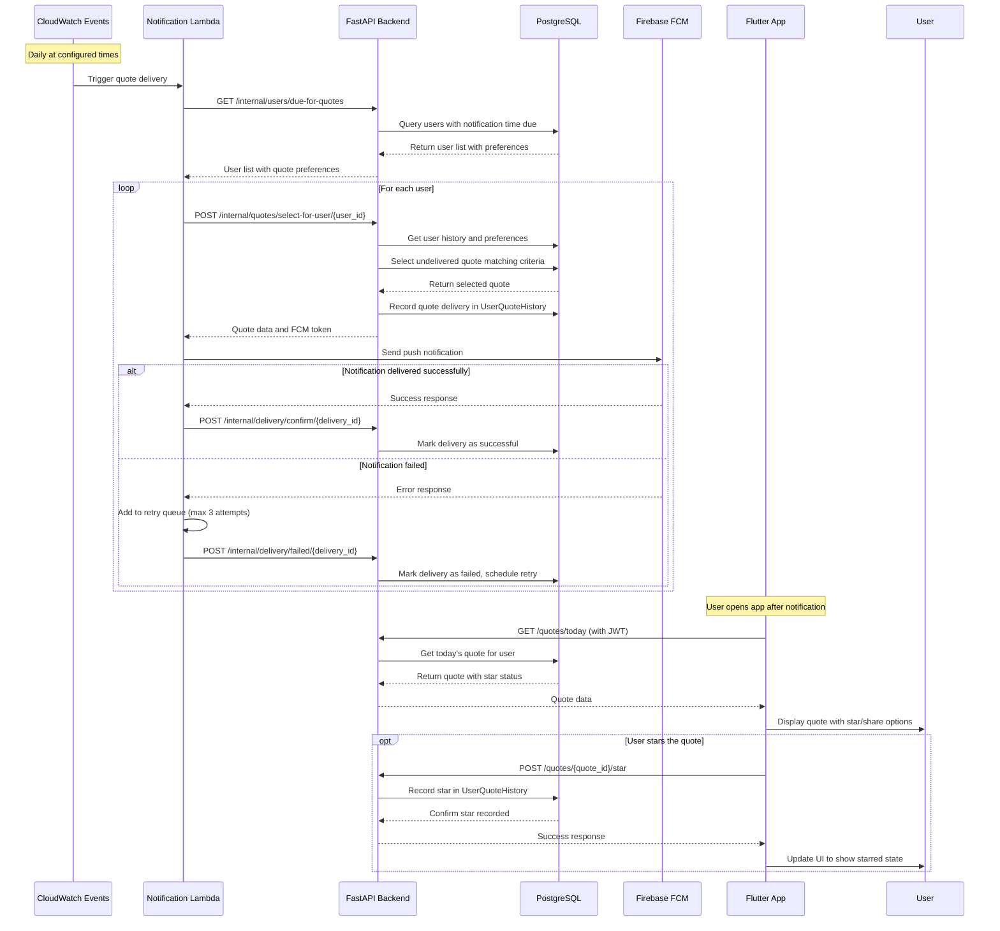
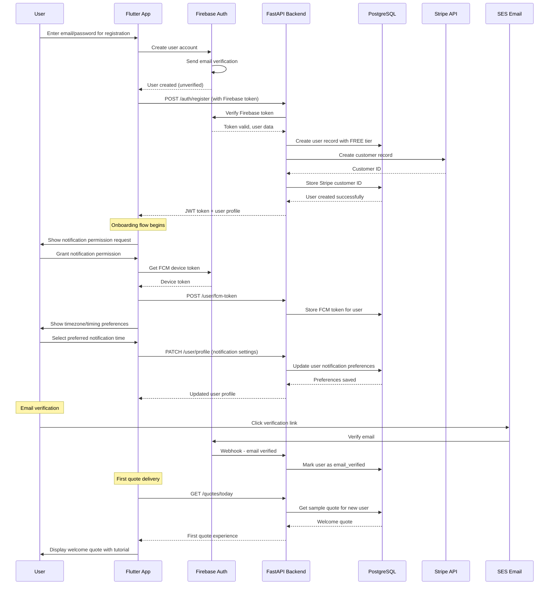
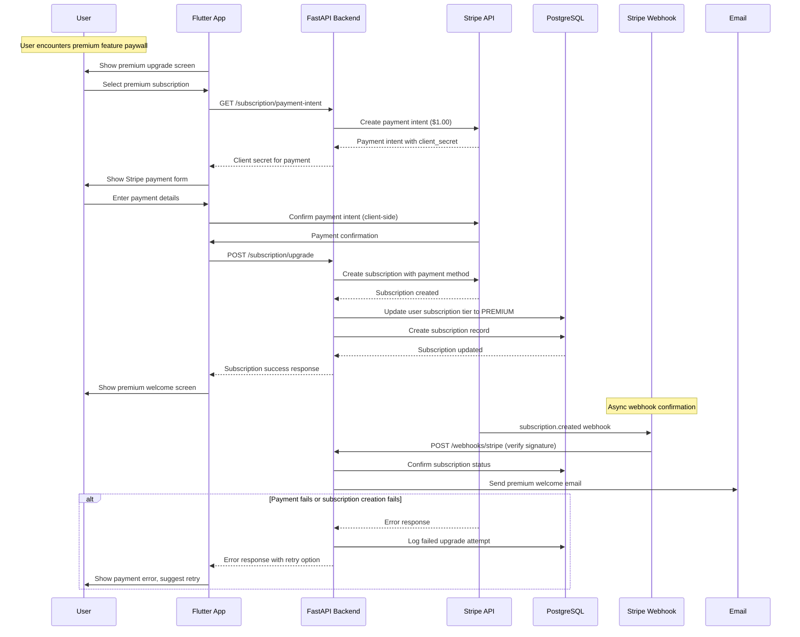
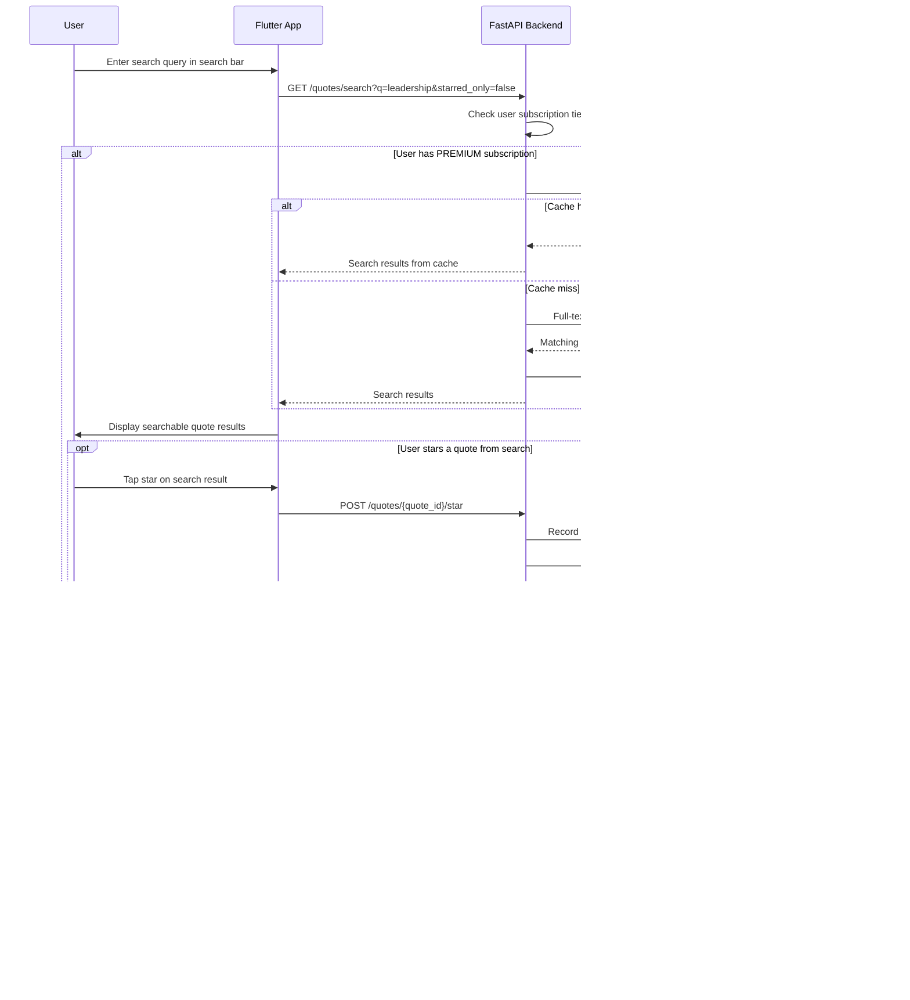

# Core Workflows

## Daily Quote Delivery Workflow

```mermaid
sequenceDiagram
    participant Scheduler as CloudWatch Events
    participant Lambda as Notification Lambda
    participant API as FastAPI Backend
    participant DB as PostgreSQL
    participant FCM as Firebase FCM
    participant Mobile as Flutter App
    participant User as User

    Note over Scheduler: Daily at configured times
    Scheduler->>Lambda: Trigger quote delivery
    Lambda->>API: GET /internal/users/due-for-quotes
    API->>DB: Query users with notification time due
    DB-->>API: Return user list with preferences
    API-->>Lambda: User list with quote preferences

    loop For each user
        Lambda->>API: POST /internal/quotes/select-for-user/{user_id}
        API->>DB: Get user history and preferences
        API->>DB: Select undelivered quote matching criteria
        DB-->>API: Return selected quote
        API->>DB: Record quote delivery in UserQuoteHistory
        API-->>Lambda: Quote data and FCM token

        Lambda->>FCM: Send push notification
        alt Notification delivered successfully
            FCM-->>Lambda: Success response
            Lambda->>API: POST /internal/delivery/confirm/{delivery_id}
            API->>DB: Mark delivery as successful
        else Notification failed
            FCM-->>Lambda: Error response
            Lambda->>Lambda: Add to retry queue (max 3 attempts)
            Lambda->>API: POST /internal/delivery/failed/{delivery_id}
            API->>DB: Mark delivery as failed, schedule retry
        end
    end

    Note over Mobile: User opens app after notification
    Mobile->>API: GET /quotes/today (with JWT)
    API->>DB: Get today's quote for user
    DB-->>API: Return quote with star status
    API-->>Mobile: Quote data
    Mobile->>User: Display quote with star/share options

    opt User stars the quote
        Mobile->>API: POST /quotes/{quote_id}/star
        API->>DB: Record star in UserQuoteHistory
        DB-->>API: Confirm star recorded
        API-->>Mobile: Success response
        Mobile->>User: Update UI to show starred state
    end
```

## User Registration and Onboarding Workflow

```mermaid
sequenceDiagram
    participant User as User
    participant Mobile as Flutter App
    participant Firebase as Firebase Auth
    participant API as FastAPI Backend
    participant DB as PostgreSQL
    participant Stripe as Stripe API
    participant Email as SES Email

    User->>Mobile: Enter email/password for registration
    Mobile->>Firebase: Create user account
    Firebase->>Firebase: Send email verification
    Firebase-->>Mobile: User created (unverified)

    Mobile->>API: POST /auth/register (with Firebase token)
    API->>Firebase: Verify Firebase token
    Firebase-->>API: Token valid, user data
    API->>DB: Create user record with FREE tier
    API->>Stripe: Create customer record
    Stripe-->>API: Customer ID
    API->>DB: Store Stripe customer ID
    DB-->>API: User created successfully
    API-->>Mobile: JWT token + user profile

    Note over Mobile: Onboarding flow begins
    Mobile->>User: Show notification permission request
    User->>Mobile: Grant notification permission
    Mobile->>Firebase: Get FCM device token
    Firebase-->>Mobile: Device token
    Mobile->>API: POST /user/fcm-token
    API->>DB: Store FCM token for user

    Mobile->>User: Show timezone/timing preferences
    User->>Mobile: Select preferred notification time
    Mobile->>API: PATCH /user/profile (notification settings)
    API->>DB: Update user notification preferences
    DB-->>API: Preferences saved
    API-->>Mobile: Updated user profile

    Note over User: Email verification
    User->>Email: Click verification link
    Email->>Firebase: Verify email
    Firebase->>API: Webhook - email verified
    API->>DB: Mark user as email_verified

    Note over Mobile: First quote delivery
    Mobile->>API: GET /quotes/today
    API->>DB: Get sample quote for new user
    DB-->>API: Welcome quote
    API-->>Mobile: First quote experience
    Mobile->>User: Display welcome quote with tutorial
```

## Premium Subscription Upgrade Workflow

```mermaid
sequenceDiagram
    participant User as User
    participant Mobile as Flutter App
    participant API as FastAPI Backend
    participant Stripe as Stripe API
    participant DB as PostgreSQL
    participant Webhook as Stripe Webhook

    Note over User: User encounters premium feature paywall
    Mobile->>User: Show premium upgrade screen
    User->>Mobile: Select premium subscription
    Mobile->>API: GET /subscription/payment-intent
    API->>Stripe: Create payment intent ($1.00)
    Stripe-->>API: Payment intent with client_secret
    API-->>Mobile: Client secret for payment

    Mobile->>User: Show Stripe payment form
    User->>Mobile: Enter payment details
    Mobile->>Stripe: Confirm payment intent (client-side)
    Stripe->>Mobile: Payment confirmation

    Mobile->>API: POST /subscription/upgrade
    API->>Stripe: Create subscription with payment method
    Stripe-->>API: Subscription created
    API->>DB: Update user subscription tier to PREMIUM
    API->>DB: Create subscription record
    DB-->>API: Subscription updated
    API-->>Mobile: Subscription success response
    Mobile->>User: Show premium welcome screen

    Note over Webhook: Async webhook confirmation
    Stripe->>Webhook: subscription.created webhook
    Webhook->>API: POST /webhooks/stripe (verify signature)
    API->>DB: Confirm subscription status
    API->>Email: Send premium welcome email

    alt Payment fails or subscription creation fails
        Stripe-->>API: Error response
        API->>DB: Log failed upgrade attempt
        API-->>Mobile: Error response with retry option
        Mobile->>User: Show payment error, suggest retry
    end
```

## Quote Search Workflow (Premium Feature)

```mermaid
sequenceDiagram
    participant User as User
    participant Mobile as Flutter App
    participant API as FastAPI Backend
    participant DB as PostgreSQL
    participant Cache as Redis Cache

    User->>Mobile: Enter search query in search bar
    Mobile->>API: GET /quotes/search?q=leadership&starred_only=false
    API->>API: Check user subscription tier

    alt User has PREMIUM subscription
        API->>Cache: Check cached search results
        alt Cache hit
            Cache-->>API: Cached results
            API-->>Mobile: Search results from cache
        else Cache miss
            API->>DB: Full-text search across quotes
            DB-->>API: Matching quotes with user star status
            API->>Cache: Store results (5 min TTL)
            API-->>Mobile: Search results
        end
        Mobile->>User: Display searchable quote results

        opt User stars a quote from search
            User->>Mobile: Tap star on search result
            Mobile->>API: POST /quotes/{quote_id}/star
            API->>DB: Record star in UserQuoteHistory
            API->>Cache: Invalidate search cache for user
            DB-->>API: Star recorded
            API-->>Mobile: Success response
            Mobile->>User: Update star state in search results
        end

    else User has FREE subscription
        API-->>Mobile: 403 Forbidden - Premium feature required
        Mobile->>User: Show premium upgrade paywall
        Mobile->>User: Limited search preview (first 3 results)

        opt User clicks upgrade
            Mobile->>User: Navigate to subscription upgrade flow
        end
    end

    Note over API: Rate limiting applied
    alt Too many search requests
        API-->>Mobile: 429 Rate limit exceeded
        Mobile->>User: Show "Please wait before searching again"
    end
```
