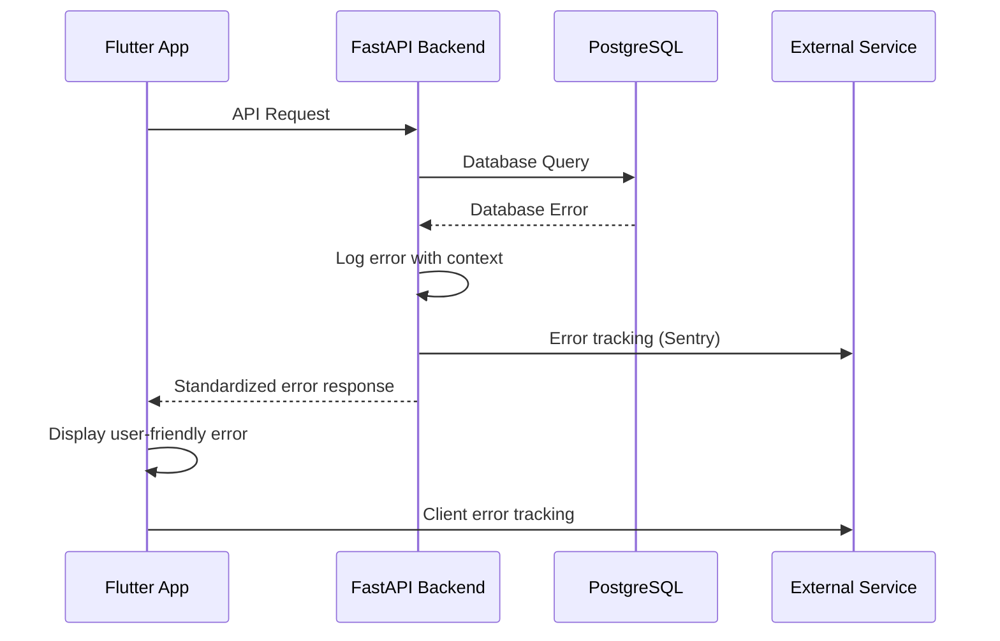

# Error Handling Strategy

## Error Flow



## Error Response Format

```typescript
interface ApiError {
  error: {
    code: string;           // Machine-readable error code
    message: string;        // Human-readable error message
    details?: Record<string, any>; // Additional context
    timestamp: string;      // ISO timestamp
    request_id: string;     // Request tracking ID
  };
}
```

## Frontend Error Handling

```dart
class ApiErrorHandler {
  static String getDisplayMessage(ApiError error) {
    switch (error.error.code) {
      case 'PREMIUM_REQUIRED':
        return 'This feature requires a premium subscription. Upgrade now!';
      case 'RATE_LIMIT_EXCEEDED':
        return 'Too many requests. Please wait a moment and try again.';
      case 'NETWORK_ERROR':
        return 'Connection issue. Please check your internet connection.';
      default:
        return error.error.message;
    }
  }

  static void showError(BuildContext context, ApiError error) {
    ScaffoldMessenger.of(context).showSnackBar(
      SnackBar(
        content: Text(getDisplayMessage(error)),
        action: error.error.code == 'PREMIUM_REQUIRED'
            ? SnackBarAction(
                label: 'Upgrade',
                onPressed: () => context.push('/subscription/upgrade'),
              )
            : null,
      ),
    );
  }
}
```

## Backend Error Handling

```python
class QuoteAPIException(HTTPException):
    def __init__(self, code: str, message: str, details: Optional[Dict] = None):
        self.code = code
        self.details = details
        super().__init__(status_code=400, detail=message)

@app.exception_handler(QuoteAPIException)
async def api_exception_handler(request: Request, exc: QuoteAPIException):
    return JSONResponse(
        status_code=exc.status_code,
        content={
            "error": {
                "code": exc.code,
                "message": exc.detail,
                "details": exc.details,
                "timestamp": datetime.utcnow().isoformat(),
                "request_id": request.state.request_id,
            }
        }
    )

# Usage in route handlers
@router.get("/search")
async def search_quotes(query: str, current_user: User = Depends(get_current_user)):
    if current_user.subscription_tier != SubscriptionTier.PREMIUM:
        raise QuoteAPIException(
            code="PREMIUM_REQUIRED",
            message="Search functionality requires premium subscription",
            details={"required_tier": "PREMIUM", "current_tier": current_user.subscription_tier}
        )
```
