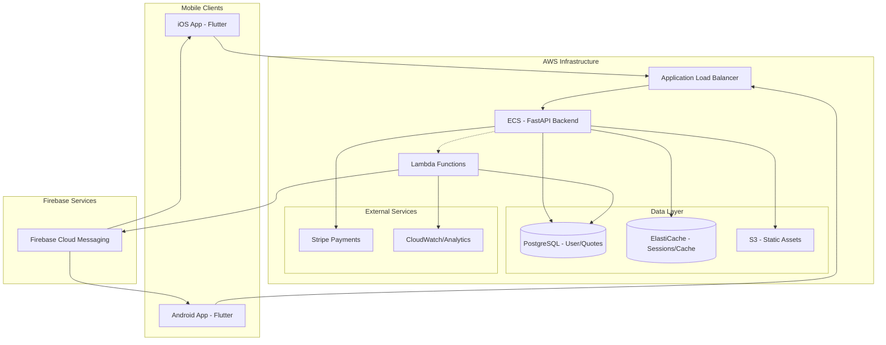

# High Level Architecture

## Technical Summary

The Quote of the Day application employs a **hybrid serverless architecture** with Flutter mobile frontend and Python FastAPI backend. The system delivers personalized quote notifications via Firebase Cloud Messaging, manages premium subscriptions through Stripe integration, and provides sophisticated quote search capabilities. Core user management and subscription logic runs on a FastAPI monolith deployed to AWS, while notification delivery and content curation leverage serverless Lambda functions for reliability and cost optimization. This architecture achieves PRD goals by ensuring 99.9% notification reliability, supporting global scale with sub-second response times, and enabling A/B testing infrastructure for freemium conversion optimization.

## Platform and Infrastructure Choice

**Platform:** AWS with Firebase Cloud Messaging
**Key Services:** ECS (FastAPI), Lambda (notifications), RDS PostgreSQL, ElastiCache Redis, API Gateway, Firebase FCM
**Deployment Host and Regions:** us-east-1 (primary), us-west-2 (backup)

**Rationale for AWS**: Given the critical importance of reliable notification delivery and the need for cost optimization (mentioned in PRD), AWS provides the best balance of reliability, scalability, and cost control for a freemium mobile application.

## Repository Structure

**Structure:** Monorepo
**Monorepo Tool:** npm workspaces with Python poetry for backend dependency management
**Package Organization:** Mobile app, FastAPI backend, shared types, infrastructure-as-code, and CI/CD configurations in single repository

**Rationale**: Monorepo enables consistent versioning across mobile and backend, simplifies deployment coordination, and allows shared TypeScript/Python type definitions for API contracts.

## High Level Architecture Diagram

## Architectural Patterns

- **Jamstack Hybrid:** Flutter mobile clients with API-driven backend - _Rationale:_ Optimal performance for mobile consumption while maintaining rich interactivity
- **Repository Pattern:** Abstract data access with SQLAlchemy ORM - _Rationale:_ Testability and future database migration flexibility
- **CQRS Light:** Separate read/write operations for quote delivery vs user management - _Rationale:_ Optimizes notification performance while maintaining data consistency
- **Event-Driven Notifications:** Serverless functions triggered by user actions and schedules - _Rationale:_ Ensures 99.9% notification reliability through redundancy
- **API Gateway Pattern:** Single FastAPI entry point with internal service routing - _Rationale:_ Centralized auth, rate limiting, and monitoring
- **Freemium Feature Gates:** Role-based access control throughout API and mobile app - _Rationale:_ Clean separation of free/premium functionality for conversion optimization
